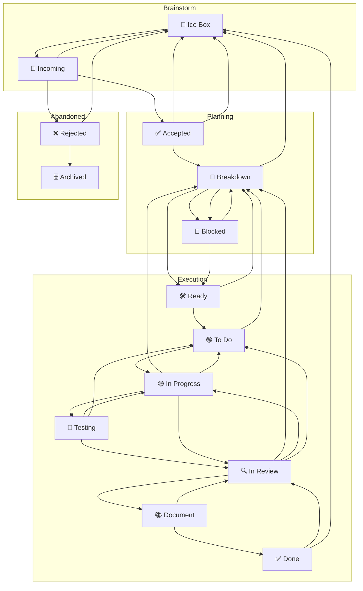

# Overview

```
1. **Intake & Associate**
```

Find or create the task; never work off-board; do not edit the board file directly—tasks drive the board. &#x20;

```
2. **Clarify & Scope**
```

Anchor on the kanban card as the single source of truth and, before advancing, do the solo pass:

- Confirm the desired outcomes so the card reflects the slice you intend to deliver.
- Capture acceptance criteria or explicit exit signals on the task so "done" is unambiguous.
- Note any uncertainties, risks, or open questions directly on the task to surface follow-ups early.
- Record the scoped plan and supporting notes on the linked task before moving to step 3.

```
3. **Breakdown & Size**
```

Break into small, testable slices; assess **complexity, scope, and Level of Effort (LoE)** and assign a Fibonacci score from **1, 2, 3, 5, 8, 13** on the task card. Scores of **13+ ⇒ must split**; **8 ⇒ continue refinement before implementation**; **≤5 ⇒ eligible to implement**. Any score **>5** must cycle back through clarification/breakdown until the slice is small enough to implement, capturing the updated score on the task card.&#x20;

4. **Ready Gate** _(hard stop before code)_
   Only proceed if:

   - A matching task is **In Progress** (or you move it there), and WIP rules aren’t violated.&#x20;
   - The slice is scored **≤5** and fits capacity after planning; otherwise continue refinement/splitting.&#x20;

```
5. **Implement Slice**
```

Do the smallest cohesive change that can clear gates defined in agent docs (e.g., no new ESLint errors; touched packages build; tests pass).&#x20;
When the scope is larger than the available session, carve off a reviewable subset and explicitly document what remains (e.g.,
inventory lingering files, capture blockers, link references).&#x20;

```
6. **Review → Test → Document**
```

Move through _In Review_, _Testing_ and _Document_ then _Done_ per board flow, recording evidence and summaries.&#x20;

# Kanban as a Finite State Machine (FSM)

We treat the board as an FSM over tasks.

- **States (C)**: the board’s columns.
- **Initial state (S)**: **Incoming** (new tasks land here; **Ice Box** for deferred work).
- **Transitions (T)**: moves between columns.
- **Rules R(Tₙ, t)**: predicates over task `t` that permit or block transition `Tₙ`.
- **Single source of status**: each task has exactly one column/status at a time.
- **Board is law**: never edit the board file directly; tasks drive board generation.
- **WIP**: a transition fails if the target state’s WIP cap is full.

> **Enforcement source of truth:** the `promethean` FSM in
> `packages/Rheos/src/rheos/backend/law/fsm.cljs`. The diagram and rules below are
> a rendering of that law; when they disagree, the law wins (and this file should be
> updated). Transitions are executed via the Rheos CLI
> (`node packages/Rheos/dist/cli.cjs status-update <uuid> --to <status>`, run from the
> **repo root** — the CLI resolves the board relative to the working directory). Every
> CLI transition stamps a `write-id` and appends a ledger event; direct frontmatter
> edits are detected as drift. There are no shortcut edges: to promote a card several
> lanes forward, walk each lawful hop in order.

### FSM diagram



### Minimal transition rules (only what matters)

- START STATES = **Ice Box** | **Incoming**
  - All new tasks must start in either **Ice Box** (future work) or **Incoming** (immediate triage).
  - This is enforced by the CLI; tasks cannot be created directly in active columns.

- **Ice Box → Incoming**
  Deferred work is ready for triage.

- **Incoming → Accepted | Rejected | Ice Box**
  Relevance/priority triage; allow defer back to Ice Box.

- **Accepted → Breakdown | Ice Box**
  Ready to analyze, or consciously deferred.

- **Breakdown → Ready | Accepted | Blocked | Rejected | Ice Box**
  Scoped & feasible → **Ready**; needs a dependency → **Blocked** (use bidirectional links); non-viable → **Rejected**; defer → **Ice Box**.

- **Blocked → Breakdown | Ready**
  Unblock event returns work to **Breakdown** for re-plan; if the dependency is simply cleared, **Ready** is also lawful.

- **Ready → Todo | Breakdown**
  Prioritized into the execution queue, or sent back for re-plan.

- **Todo → In Progress**
  Pulled by a worker. This transition is **WIP-gated**: it fails if **In Progress** is at its cap.

- **In Progress → Testing | Todo | Breakdown**
  Default forward flow is **Testing** (always-allowed). Send back to **Todo** for a session-end handoff, or to **Breakdown** if the slice needs re-planning.

- **In Progress → Review** _(gated shortcut)_
  A direct move from **In Progress** to **Review** is allowed only when the project’s build-gate commands (`pnpm build`, `pnpm lint`, `pnpm test`) exit cleanly. This is a shortcut, not the default flow.

- **Testing → Review | In Progress | Todo**
  Testing complete → **Review**; tests failed or need adjustment → **In Progress** or **Todo**.

- **Review → Document | In Progress | Todo**
  Review approved → **Document**; changes requested → **In Progress** (preferred) or **Todo** (fallback).

- **Document → Done | Review**
  Docs/evidence complete → **Done**; otherwise → **Review** for another pass.

- **Done → Ice Box | Review**
  Done work can be reopened to **Review** or sent back to **Ice Box**; follow-ups are modeled as new tasks.

- **Any state → Rejected**
  Work that is non-viable or explicitly abandoned.

- **Any state → Archived**
  Terminal exit for tasks that are no longer tracked. This edge is not rendered individually in the diagram above.

### Blocking policy

- **Minor blockers**: record briefly on the task; continue with other eligible work; resolve asynchronously.
  - Uncertainty over a single aspect of an assignment which does not prevent completion of other aspects of the assignment
- **Major blockers**: halt work on that task; capture evidence + attempt remediation
  - A triggered transition rule would result in a column begin over it's WIP limit
  - An agent's current task has only blocked sub tasks

## 🌊 Fluid Kanban Rule Evolution

Kanban is a fluid process that adapts to changing development environments while maintaining core principles.

### When Rules Must Change

A rule should be changed when:

1. **Progress is blocked** despite valid work being ready
2. **Team composition changes** significantly (new contributors, new agent types)
3. **Process discovery** reveals better ways of working
4. **Scaling requirements** exceed current capacity constraints

### Rule Change Process

1. **Identify the constraint**: Which specific rule is preventing forward progress?
2. **Document the rationale**: Why must this rule change now? What's the impact?
3. **Propose a new rule**: Clear, measurable, and time-bound
4. **Implement temporarily**: Test the change with explicit review date
5. **Evaluate and formalize**: Either revert, adjust, or make permanent

### WIP Limit Evolution Example

**Original Rule**: 2 tasks in review per human developer
**Reality**: 1 human + 6-18 AI agents contributing simultaneously
**Constraint**: Review bottleneck blocking all flow
**Solution**:

- Review: 2 → 6 (human review bandwidth for AI work)
- In Progress: 3 → 10 (multi-agent parallel work capacity)
- Document: 2 → 4 (maintain flow proportion)

### Guiding Principles for a Supportive Board

- **The board serves the team, not the other way around**
- **Work gets done, sometimes outside formal processes - and that's okay**
- **Retrospective card movement is a ritual of acknowledgment, not compliance**
- **Failed checks are learning opportunities, not violations**
- **We think better when we're calm** - even urgent work deserves a thoughtful response
- **Focus on capacity and flow** - "We may have taken on more work than we can handle, let's reevaluate priorities"

- **Rules enable flow, they don't dictate activity**
- **Change is temporary unless proven valuable**
- **Document every change with clear rationale**
- **Review changes regularly** (monthly for significant rule changes)
- **Maintain the spirit** of the rule even when adapting the letter
