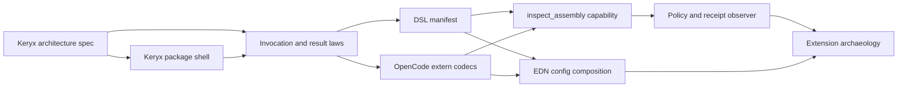

# What's next? We should create kanban tasks yes? Following the repos PROCESS.md doc

Yes. **The next action is to create a Keryx epic and a small set of Incoming task cards—not to write package code yet.** The repository process requires work to begin on-board, tasks to be clarified with acceptance criteria and notes, and implementation slices to score at most 5 points; anything above that must be split before it can enter active work.[^13_1]

The existing board already uses individual Markdown task files under `kanban/tasks/`, with frontmatter including `uuid`, `title`, `status`, `priority`, labels, source, points, and category.  Do **not** edit `.kanban/board.json`; task cards drive the board.[^13_2][^13_1]

## Proposed epic

Create:

```text
kanban/epics/keryx-opencode-assembly.md
```

Title:

```text
Keryx — OpenCode Assembly and Declaration Interpreter
```

Initial status should be **Incoming**, not Accepted or Breakdown. The process explicitly requires new work to begin in Ice Box or Incoming.[^13_1]

```md
---
uuid: "keryx-opencode-assembly"
title: "Keryx — OpenCode Assembly and Declaration Interpreter"
status: "incoming"
priority: "P0"
labels: ["epic", "keryx", "opencode", "cljs", "dsl", "extern", "agent"]
created_at: "2026-07-10T15:35:00Z"
category: "epics"
---

# Keryx — OpenCode Assembly and Declaration Interpreter

## Intent

Establish Keryx as ημ's lawful herald: a ClojureScript-first
declaration interpreter that assembles capabilities, interceptors,
observers, profiles, and target exposures, then compiles them into an
OpenCode plugin artifact.

Keryx is not a generic runtime or a replacement extension bundle. It
does not own domain behavior. It proves that declared ημ behavior is
lawful, assembles only admitted definitions, and carries them through
an explicit `extern.*` boundary into a host.

## Why now

`packages/extensions` contains valuable constitutional behavior, but
its current extension-shaped composition reflects a Pi-first history
followed by OpenCode adaptation. OpenCode is now the reference target:
its rich plugin, hook, tool, session, configuration, and permission
surface will expose missing semantics early.

The initial objective is not migration. It is a new, inspectable,
OpenCode-first vertical slice that proves the architecture before
existing extensions are rehoused.

## Semantic model

- ημ owns declarations, contracts, configuration, and ledgers.
- Keryx owns assembly, validation, invocation, and target translation.
- `extern.*` exclusively owns raw JavaScript, Node, and OpenCode values.
- `domain.*` remains pure and never observes host objects.
- `infra.*` orchestrates effects using ημ values only.
- OpenCode is the first target, not the universal vocabulary.

## Initial vertical slice

- Capability: `:keryx/inspect-assembly`
- Interceptor: `:policy/protect-secrets`
- Observer: `:ledger/record-invocation`
- Target: OpenCode
- Source configuration: `.ημ/config/{keryx,opencode}/**/*.edn`

## Exit signals

- A generated OpenCode plugin exposes `inspect_assembly`.
- A real or fixture OpenCode invocation crosses `extern.opencode`,
  becomes a validated ημ invocation, executes only ημ logic, and is
  rendered back to an OpenCode result.
- A before-tool policy can reject a secret-file operation.
- A completed invocation creates a receipt-shaped observer outcome.
- The assembly reports its admitted definitions, grants, and target
  incompatibilities.
- Raw JS interop is mechanically restricted to `keryx.extern.*` and
  host entrypoint namespaces.
- No existing extension is migrated until this reference slice passes.

## Non-goals

- Rewriting `packages/extensions`.
- Recreating every current extension.
- Supporting Pi, MCP, CLI, or Fastify targets in the first slice.
- Modeling every OpenCode hook before one end-to-end path works.
- Inventing a generic arbitrary-library adapter DSL.

## Candidate follow-up migrations

- Receipt river -> observer plus ledger sink.
- OPMF contract gate -> interceptor / adjudication policy.
- Contract runtime -> law plus adjudication capability.
- Session mycology -> lifecycle observer and projection capability.
- OpenCode global instructions -> OpenCode target mapping.
```

The framing matches the repository’s current charter: ημ is intended as an auditable orchestration substrate, not “the place where every absorbed package goes forever.”[^13_1]

## Create these tasks

Create the following as **Incoming** cards linked to the epic. They are intentionally not implementation-ready yet; clarification and sizing are the next gate.[^13_1]


| Task ID | Title | Suggested points after breakdown | Why it exists |
| :-- | :-- | --: | :-- |
| `keryx-architecture-spec` | Keryx — Specify Assembly, Extern, and Target Laws | 3 | Locks vocabulary and boundaries before code |
| `keryx-package-shell` | Keryx — Create CLJS Package and Quality Gates | 3 | Builds isolated workspace shell |
| `keryx-core-shapes-laws` | Keryx — Define Invocation, Result, and Descriptor Contracts | 5 | Establishes shared data contract |
| `keryx-dsl-manifest` | Keryx — Implement Declarative Capability Manifest | 5 | Proves `defschema` / `defcapability` / `deftool` metadata |
| `keryx-opencode-extern` | Keryx — Decode and Encode OpenCode Tool Boundary | 5 | Contains JS/OpenCode interop |
| `keryx-assembly-inspection-tool` | Keryx — Compile `inspect_assembly` for OpenCode | 5 | First complete vertical slice |
| `keryx-policy-receipts` | Keryx — Add Secret Policy and Invocation Receipt Observer | 5 | Proves interceptor / observer model |
| `keryx-config-composition` | Keryx — Compose `.ημ` OpenCode Config Fragments | 5 | Adds data-first project configuration |
| `keryx-extension-archeology` | Keryx — Classify Existing Extensions for Rehousing | 3 | Extracts semantic roles without migration |

The breakdown is consistent with the repo’s requirement that 8-point work receive further refinement and 13+ point work must split; only tasks at 5 or below become eligible for implementation.[^13_1]

## First task card

The first task should be the architecture spec, because the repository’s construction order requires discovery, description, specification, then law and shape before extern, domain, or infra work.[^13_1]

```text
kanban/tasks/keryx-architecture-spec.md
```

```md
---
uuid: "keryx-architecture-spec"
title: "Keryx — Specify Assembly, Extern, and Target Laws"
status: "incoming"
priority: "P0"
labels: ["tasks", "keryx", "opencode", "cljs", "dsl", "architecture"]
created_at: "2026-07-10T15:35:00Z"
source: "kanban/epics/keryx-opencode-assembly.md"
points: 3
category: "tasks"
---

# Keryx — Specify Assembly, Extern, and Target Laws

> Parent epic: `kanban/epics/keryx-opencode-assembly.md`
> Points: 3

## Purpose

Write the design specification that establishes Keryx as ημ's lawful
declaration assembly and host-translation layer, with OpenCode as the
first reference target.

## Scope

- Define Keryx's responsibility and explicit non-goals.
- Define the distinction between ημ declarations, Keryx assembly, and
  host target artifacts.
- Define `extern.*` as the exclusive foreign-object boundary.
- Define the canonical invocation, result, capability, interceptor,
  observer, exposure, effect, and trace vocabulary.
- Define target support declarations and explicit incompatibility
  reporting.
- Define the first OpenCode vertical slice and its test evidence.
- Define the migration classification process for existing extensions.

## Acceptance criteria

- [ ] A design document exists at `docs/design/keryx-assembly.md`.
- [ ] The document explicitly bans `runtime.*` as a Keryx catch-all.
- [ ] The document defines namespace ownership for `law`, `shape`,
  `extern`, `domain`, `infra`, `dsl`, and `target`.
- [ ] The document states that only `extern.*` and host entrypoints may
  use raw JS interop or direct npm imports.
- [ ] The document defines the initial four declaration forms:
  `defschema`, `defcapability`, `definterceptor`, and `defobserver`.
- [ ] The document defines `inspect_assembly` as the first required
  OpenCode vertical slice.
- [ ] The document identifies receipt river, contract runtime,
  session mycology, OPMF contract gate, and OpenCode global
  instructions as migration candidates without prescribing code moves.

## Verification

```bash
test -f docs/design/keryx-assembly.md
rg "runtime" docs/design/keryx-assembly.md
rg "extern" docs/design/keryx-assembly.md
```


## Risks and questions

- Decide whether Keryx starts as one package with `target.opencode.*`,
or whether the OpenCode target becomes a separate workspace package
after the reference slice.
- Confirm the existing `@open-hax/keryx` repository/package ownership
and whether this work belongs there or in the ημ monorepo.
- Preserve the authority of ημ contracts and `.ημ` configuration;
Keryx must not become a competing constitution.

```

This card is small, testable, and matches the project’s own distinction between `law`, `shape`, `extern`, `domain`, and `infra`.[^13_1]

## Second task card

The next small task is the workspace shell—not the DSL implementation.

```text
kanban/tasks/keryx-package-shell.md
```

```md
---
uuid: "keryx-package-shell"
title: "Keryx — Create CLJS Package and Quality Gates"
status: "incoming"
priority: "P0"
labels: ["tasks", "keryx", "cljs", "workspace", "quality"]
created_at: "2026-07-10T15:35:00Z"
source: "kanban/epics/keryx-opencode-assembly.md"
points: 3
category: "tasks"
---

# Keryx — Create CLJS Package and Quality Gates

> Parent epic: `kanban/epics/keryx-opencode-assembly.md`
> Depends on: `keryx-architecture-spec`
> Points: 3

## Purpose

Create the isolated ClojureScript workspace package that will host the
Keryx assembly interpreter and its OpenCode reference target.

## Scope

- Create `packages/keryx/`.
- Add pnpm workspace package metadata.
- Add a Shadow CLJS test and build configuration.
- Add package-local clj-kondo configuration using the shared house
  rules.
- Add `.ημ/PRINCIPLE.edn`.
- Add a package README containing the Keryx responsibility and
  explicit non-goals.
- Add minimal law/shape/extern/domain/infra/dsl/target namespace
  placeholders and one passing test.

## Acceptance criteria

- [ ] `packages/keryx/package.json` names `@open-hax/keryx`.
- [ ] The package has no TypeScript source files.
- [ ] `pnpm --filter @open-hax/keryx test` passes.
- [ ] `pnpm --filter @open-hax/keryx build` passes.
- [ ] `pnpm --filter @open-hax/keryx lint:kondo` passes with zero
  warnings.
- [ ] Package namespaces do not include a `runtime.*` catch-all.
- [ ] The README records that OpenCode is the reference target and ημ
  remains the source of semantic declarations.

## Verification

```bash
pnpm --filter @open-hax/keryx test
pnpm --filter @open-hax/keryx build
pnpm --filter @open-hax/keryx lint:kondo
find packages/keryx -name '*.ts' -o -name '*.tsx'
```

```

## Task dependency graph



This is intentionally **not** a strict migration plan. The artifact produced by the first tool should inform later extraction of receipt river, contract gate, session mycology, and related integrations.

## Board movement

After creating the epic and tasks:

1. Leave all cards in **Incoming**.
2. Triage the epic into **Accepted** once you agree Keryx is the correct package and scope.
3. Move `keryx-architecture-spec` to **Breakdown** for the solo clarify-and-scope pass.
4. Confirm it remains 3 points.
5. Move it through **Ready → Todo → In Progress** only when capacity/WIP allows.
6. Do not start package code until the specification task has reached **Done** or at least yielded an explicit, accepted design artifact.

That sequence follows the process’s hard ready gate: an active task must be in progress, respect WIP, and be sized at 5 or below before implementation begins.[^13_1]

The only decision that needs resolving before task creation is whether `packages/keryx/` belongs inside this monorepo now or whether the existing standalone `open-hax/keryx` repository should remain its canonical home; that changes the epic’s target location, but not the semantic plan.

<div align="center">⁂</div>

[^13_1]: https://clojurescript.org/

[^13_2]: https://clojurescript.org/reference/compiler-options